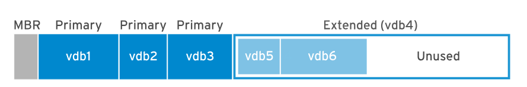

# Installazione RHEL

## Supporto di installazione

Red Hat fornisce diversi tipi di media di installazione che puoi scaricare dal sito web del Customer Portal utilizzando il tuo abbonamento attivo:

* **Immagine ISO:** Un file immagine binario in formato ISO 9660 che contiene il programma di installazione _Anaconda_ Red Hat Enterprise Linux e i repository di pacchetti BaseOS e AppStream. Questi contengono tutti i pacchetti necessari per completare l'installazione senza la necessità di ulteriori repository.
* **Immagine Boot ISO:** Un file immagine "boot ISO" più piccolo che contiene Anaconda e richiede una rete configurata per accedere ai repository di pacchetti resi disponibili tramite HTTP, FTP o NFS.
* **Immagine QCOW2:** Contiene un disco di sistema predefinito, pronto per essere distribuito come macchina virtuale in ambienti cloud o enterprise virtual. Red Hat utilizza QCOW2 come formato standard per la virtualizzazione basata su KVM.
* **Codice Sorgente:** Codice sorgente per Red Hat Enterprise Linux. I DVD sorgenti non contengono documentazione. Questa immagine è utile per compilare o sviluppare il tuo software in base alla versione Red Hat Enterprise Linux.

### Architetture Supportate

Red Hat Enterprise Linux 9 supporta le seguenti architetture:

* Architetture AMD e Intel a 64-bit (x86-64-v2)
* Architettura ARM a 64-bit (ARMv8.0-A)
* IBM Z a 64-bit (z14)
* IBM Power Systems, Little Endian (POWER9)

Dopo aver scaricato, crea i media di installazione avviabili seguendo le istruzioni nella sezione di riferimento.

### Costruire l'immagine usando _<mark style="color:orange;">Image builder</mark>_

Lo strumento _<mark style="color:orange;">Red Hat Image Builder</mark>_ aiuta a creare immagini personalizzate di Red Hat Enterprise Linux. \
&#xNAN;_&#x49;mage Builder_ consente agli amministratori di costruire immagini di sistema personalizzate per il deployment su piattaforme cloud o in ambienti virtuali per casi d'uso specializzati.&#x20;

Usa il comando <mark style="color:orange;">`composer-cli`</mark> o l'interfaccia della console web di Red Hat per accedere a _Image Builder_.

### Requisiti di memoria e di dischi

<table><thead><tr><th valign="top">tipo di installazione</th><th valign="top">RAM minima raccomandata</th></tr></thead><tbody><tr><td valign="top">Local media installation (USB, DVD)</td><td valign="top">
1.5 GiB per x86-64-v2, ARMv8.0-A e archs z14;

3 GiB per arch POWER9
</td></tr><tr><td valign="top">NFS network installation</td><td valign="top">
1.5 GiB per x86-64-v2, ARMv8.0-A e archs z14;

3 GiB per POWER9 arch
</td></tr><tr><td valign="top">HTTP, HTTPS, or FTP network installation</td><td valign="top">
3 GiB per x86-64-v2 e z14 archs;

4 GiB per ARMv8.0-A e arch POWER9
</td></tr></tbody></table>

* Deve avere anche un minimo di 10GiB di partizione libera

## Installazione manuale RHEL

Per installare un nuovo sistema RHEL su un server bare-metal o una macchina virtuale, gli amministratori utilizzano il DVD binario o l'immagine ISO di avvio. \
Il **programma&#x20;**_**Anaconda**_ supporta due metodi di installazione: manuale e automatizzato:

* L'installazione _<mark style="color:orange;">**manuale**</mark>_ interagisce con l'utente per stabilire come _Anaconda_ installa e configura il sistema.&#x20;
* L'installazione _<mark style="color:orange;">**automatizzata**</mark>_ utilizza un file _Kickstart_ per indicare ad Anaconda come installare il sistema.

### Installazione RHEL da GUI

<figure><figcaption></figcaption></figure>

* <mark style="color:orange;">KDUMP</mark>: la funzionalità _kdump_ del kernel raccoglie informazioni sullo stato della memoria di sistema quando il kernel si arresta in modo anomalo. Gli ingegneri di Red Hat analizzano un file kdump per identificare la causa di un crash. Utilizzare questo elemento di Anaconda per abilitare o disabilitare kdump.

### Risoluzione problemi per l'installazione

<table><thead><tr><th valign="top">Sequenza tasti</th><th valign="top">Contenuto</th></tr></thead><tbody><tr><td valign="top"><strong>Ctrl</strong>+<strong>Alt</strong>+<strong>F1</strong></td><td valign="top">Accesso al terminale multiplexer <code>tmux</code>.</td></tr><tr><td valign="top"><strong>Ctrl</strong>+<strong>B</strong> <strong>1</strong></td><td valign="top">nel terminale <code>tmux</code>, accesso alla pagina d'info principale per il processo di installazione.</td></tr><tr><td valign="top"><strong>Ctrl</strong>+<strong>B</strong> <strong>2</strong></td><td valign="top">nel terminale <code>tmux</code>, fornisce una shell di root. Anaconda conserva i file log di installazione nella directory <code>/tmp</code>.</td></tr><tr><td valign="top"><strong>Ctrl</strong>+<strong>B</strong> <strong>3</strong></td><td valign="top">nel terminale <code>tmux</code>, visualizza il contenuto del file di log <code>/tmp/anaconda.log</code>.</td></tr><tr><td valign="top"><strong>Ctrl</strong>+<strong>B</strong> <strong>4</strong></td><td valign="top">nel terminale <code>tmux</code>, visualizza il contenuto del file di log <code>/tmp/storage.log</code>.</td></tr><tr><td valign="top"><strong>Ctrl</strong>+<strong>B</strong> <strong>5</strong></td><td valign="top">nel terminale <code>tmux</code>, visualizza il contenuto del file di log <code>/tmp/program.log</code>.</td></tr><tr><td valign="top"><strong>Ctrl</strong>+<strong>Alt</strong>+<strong>F6</strong></td><td valign="top">Accesso alla GUI di Anaconda.</td></tr></tbody></table>

